## AI Assisted Compliance Assessment Tool

A Proof of Concept (PoC) cybersecurity compliance assessment tool based on selected controls mapped to ISO/IEC 27001:2022 and the NIS2 Directive, with AI assisted interpretation of the results.

---

## Project Summary

This project was developed as the practical implementation of my diploma thesis on the use of artificial intelligence to support cybersecurity compliance assessments. The tool evaluates four selected cybersecurity control areas through predefined deterministic rules, with each control mapped to relevant requirements of ISO/IEC 27001:2022 and NIS2. 

Based on the information provided by the user, each control is assigned one of four assessment statuses: Satisfied, Partially Satisfied, Not Satisfied, or Not Assessable. The assessment results are then used to calculate a coverage score for the selected controls.  Artificial intelligence is integrated as an interpretation and reporting layer, using the completed assessment findings to generate a structured Executive Explanation for the user. The assessment logic, scoring, and framework mappings remain deterministic and predefined. The final results are presented through the Streamlit interface and can also be exported as a standalone HTML report.

---

## Security Controls Assessed

| Security Control | ISO/IEC 27001:2022 | NIS2 |
|---|---|---|
| Multi-Factor Authentication | A.8.5 – Secure authentication | Article 21(2)(j) |
| Backup | A.8.13 – Information backup | Article 21(2)(c) |
| Vulnerability Management | A.8.8 – Management of technical vulnerabilities | Article 21(2)(e) |
| Incident Response | A.5.24, A.5.26 | Article 21(2)(b) |


---

## Architecture & Assessment Workflow

The tool follows a structured assessment workflow that separates user input, deterministic evaluation, scoring, AI assisted interpretation and reporting.

1. **Organization Profile**  
   The user enters basic organization information such as name, size, number of employees and sector.

2. **Security Control Assessment**  
   The user provides information for the four selected control areas: Multi-Factor Authentication, Backup,  Vulnerability Management and Incident Response.

3. **Input Validation**  
   The submitted information is validated before being processed by the assessment engine.

4. **Deterministic Evaluation**  
   Predefined rules evaluate each security control and assign the appropriate assessment status.

5. **Scoring and Framework Mapping**  
   The assessment results are used to calculate the selected controls coverage score, while each control is associated with its relevant ISO/IEC 27001:2022 and NIS2 requirements.

6. **AI Interpretation**  
   The completed assessment findings are provided to the AI layer, which generates a structured Executive Explanation of the results.

7. **Results and Reporting**  
   The application presents the assessment results through the Streamlit interface and generates a downloadable HTML report containing the detailed control findings, framework mappings, recommendations, evidence observations, and Executive Explanation (Overview, Management Interpretation, Priority Actions ,Information Gaps).

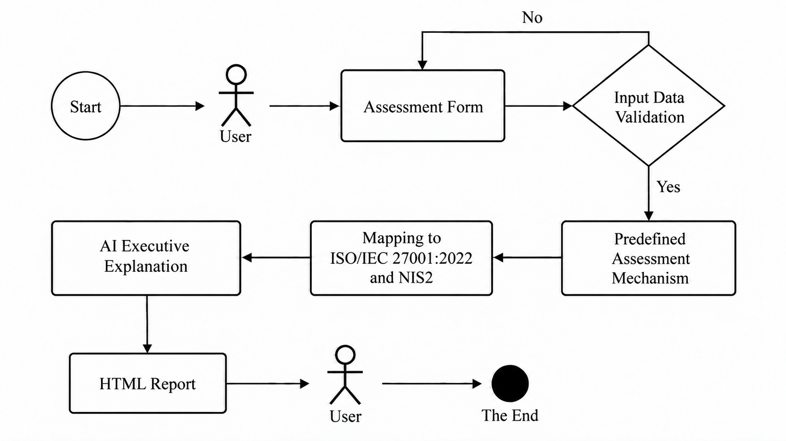


## What I Implemented

- Built the Python application in Visual Studio Code using Streamlit (app.py)
- Created structured organization and security control assessment forms (app.py, form_adapter.py)
- Implemented input validation to verify the submitted organization and security control data before assessment (validator.py, organization_schema.json)
- Developed a deterministic rule engine for the four cybersecurity control areas (rule_engine.py)
- Created a scoring mechanism that excludes Not Assessable controls from the denominator (scoring.py)
- Created predefined mappings between selected **ISO/IEC 27001:2022** controls and **NIS2 Article 21** requirements (control_catalogue.json)
- Integrated the OpenAI API for AI interpretation of assessment results (llm_provider.py)
- Added safeguards to keep the deterministic assessment results unchanged during AI summary generation (ai_summary.py)
- Developed standalone HTML report generation using Jinja2 (report_generator.py, report_template.html)
- Implemented automated tests for validation, rule evaluation, scoring, AI result integrity, and report generation (tests/)

---

## Example Assessment Scenarios

To evaluate how the tool behaves under different conditions, two synthetic organization scenarios were created and assessed. The first scenario represents a mixed security situation, with controls producing different assessment outcomes, allowing the rule engine, scoring mechanism, Not Assessable handling and AI explanation to be tested together. The second scenario represents an organization in which all four selected controls satisfy the predefined assessment criteria, demonstrating that the tool can also correctly identify and report a fully satisfied assessment rather than focusing only on gaps and remediation needs.

-> Scenario 1 (Mixed Assessment)

The first thesis evaluation scenario produced the following results:

- Multi-Factor Authentication - Satisfied
- Backup and Restore Testing - Partially Satisfied
- Vulnerability Management - Not Satisfied
- Incident Response - Assessable

-> Scenario 2 (Satisfied Controls)

The second thesis evaluation scenario resulted in all four selected controls being assessed as Satisfied.

- 4/4 assessable controls
- 4/4 earned points
- 100% selected controls coverage

The following screenshots show the assessment output generated for these two scenarios.

---

## Screenshots

<details>
   
<summary>🔎 View Full Lab Walkthrough (Screenshots)</summary>


### Scenario 1 – Organization Profile
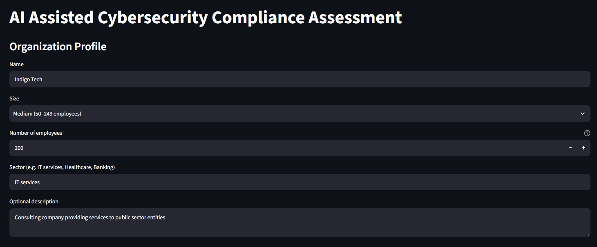

### MFA
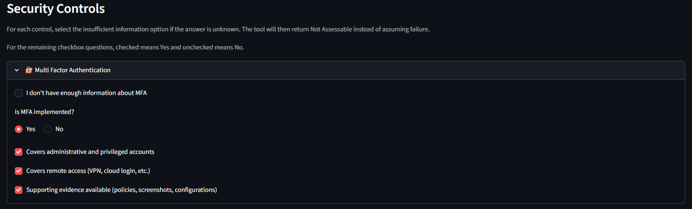

### Backup
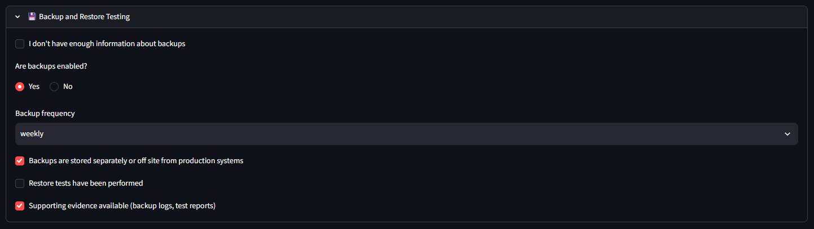

### Vulnerability Management and Incident Response
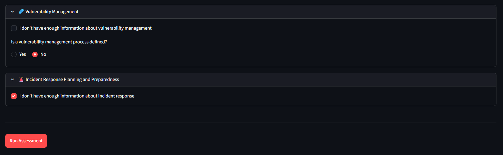

### Assessment Result 
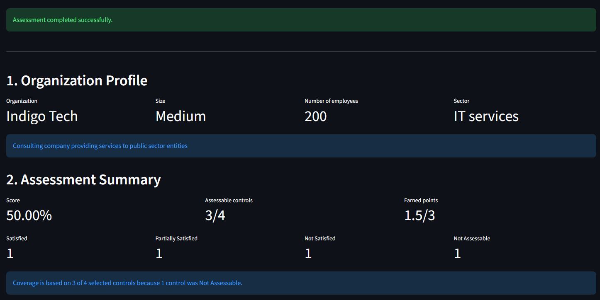
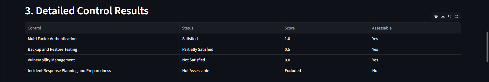

### MFA Result 
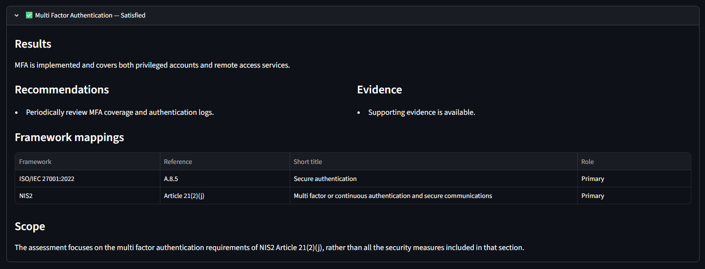

### Backup Result 
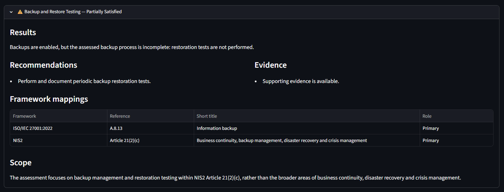

### Vulnerability Management Result 
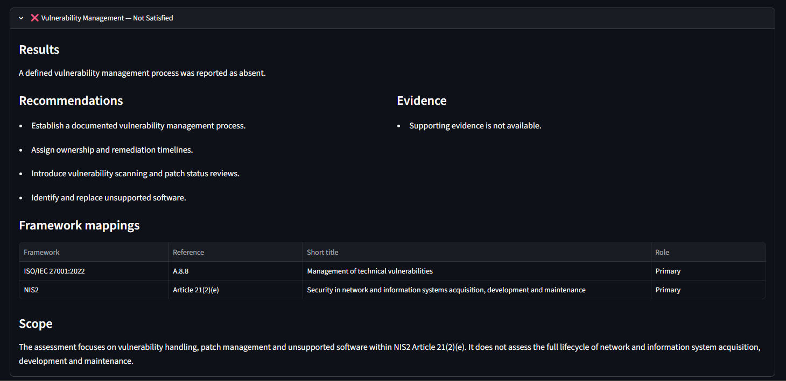

### Incident Response Result 
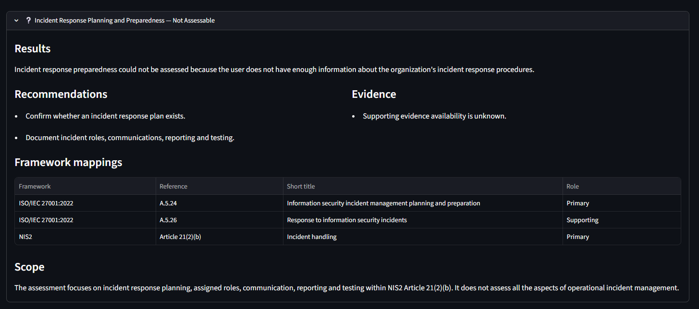
</details>

## Tools & Technologies

- Python
- Streamlit
- OpenAI API
- JSON Schema
- Jinja2
- pandas
- pytest
- HTML / CSS
- Git & GitHub
- Visual Studio Code

---

### Main Components

- `data/` – JSON Schema, framework mappings, synthetic scenarios, and expected deterministic results
- `docs/` – architecture and technical design decisions
- `images/` – application and assessment screenshots
- `src/` – deterministic assessment logic, scoring, AI integration, validation, and reporting
- `templates/` – HTML report template
- `tests/` – automated test suite
- `app.py` – Streamlit application entry point

---

## Running the Tool

Clone the repository:

```bash
git clone https://github.com/RakipGit/AI-Assisted-Compliance-Assessment-Tool.git
cd AI-Assisted-Compliance-Assessment-Tool
```

Create and activate a Python virtual environment.

Install the required dependencies:

```bash
pip install -r requirements.txt
```

Create a local `.env` file based on `.env.example` and provide your OpenAI API key:

```env
OPENAI_API_KEY=your_openai_api_key
OPENAI_MODEL=gpt-5-mini
```

Run the Streamlit application:

```bash
streamlit run app.py
```

---

## Scope and Limitations

This project is a **Proof of Concept** and evaluates only four selected cybersecurity control areas.

The tool does not provide:

- ISO/IEC 27001 certification
- official NIS2 compliance confirmation
- audit assurance
- legal advice
- a complete assessment of an organization's cybersecurity posture

The assessment is based on user-provided information and does not independently verify supporting evidence.

The scoring model and selected evaluation thresholds are prototype design decisions and must not be interpreted as official ISO/IEC 27001 or NIS2 compliance metrics.

---

## Insights & Lessons Learned

- Separating deterministic assessment logic from AI-generated explanations improves reproducibility and transparency.
- AI can support the interpretation of cybersecurity compliance results without being responsible for the underlying assessment decision.
- Missing information should be distinguished from confirmed control failure, which led to the use of the **Not Assessable** status.
- Mapping related security controls between ISO/IEC 27001 and NIS2 helps demonstrate how common security practices can support requirements across different frameworks.
- Structured input validation is important before assessment logic is executed.
- Automated testing helps verify that rule evaluation, scoring, result integrity, and report generation behave consistently.
- A modular architecture makes it easier to separate validation, assessment, scoring, AI interpretation, and reporting responsibilities.

---

## Copyright Notice

All content and visuals in this repository are original and may not be reused without permission.


## Rakip 

ICT Engineering | Cybersecurity & Network Security

---
